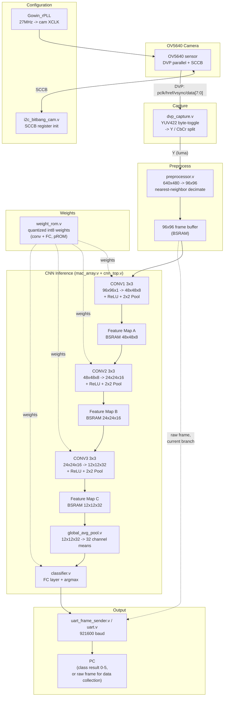
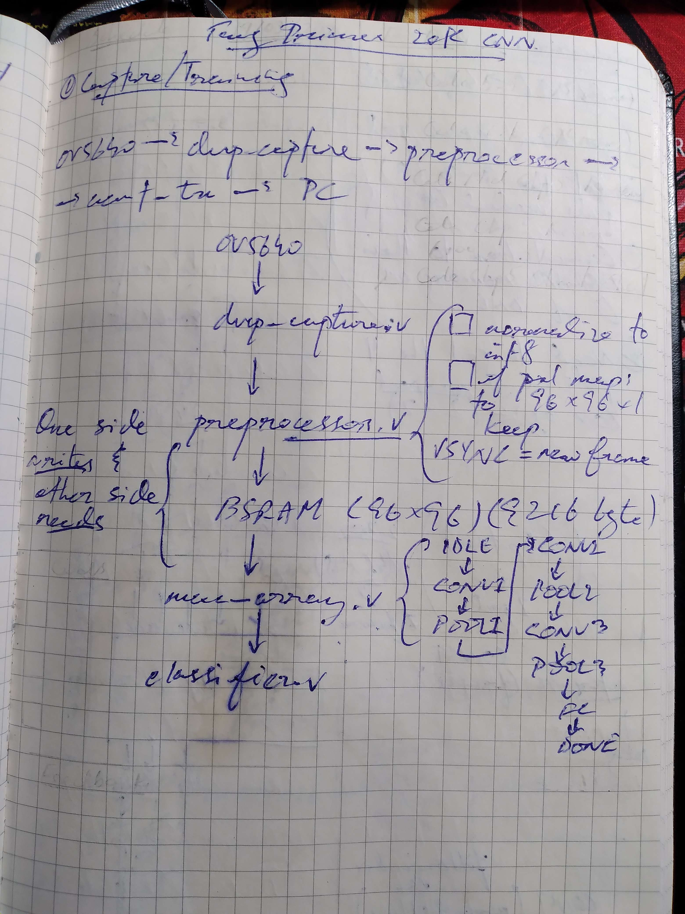
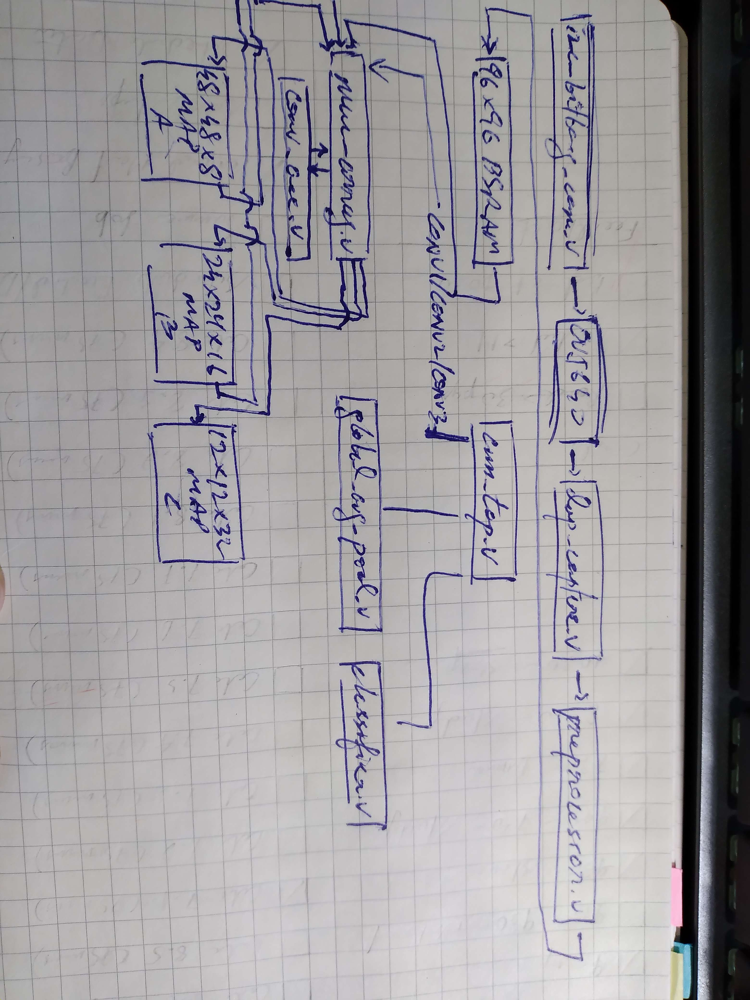
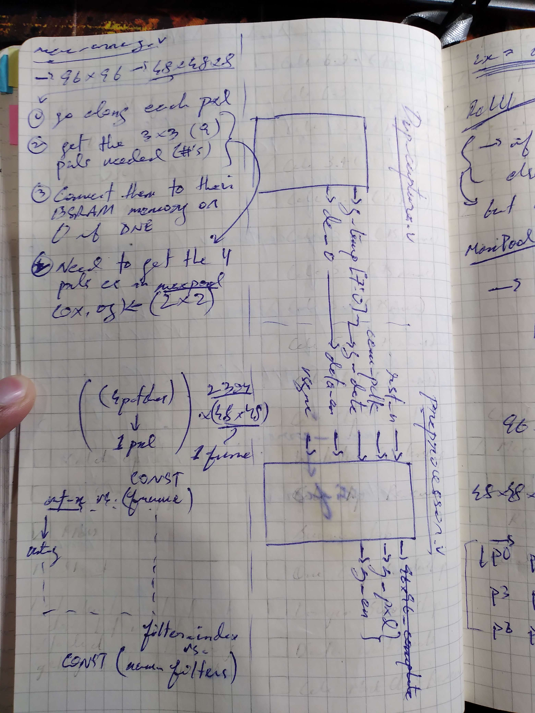
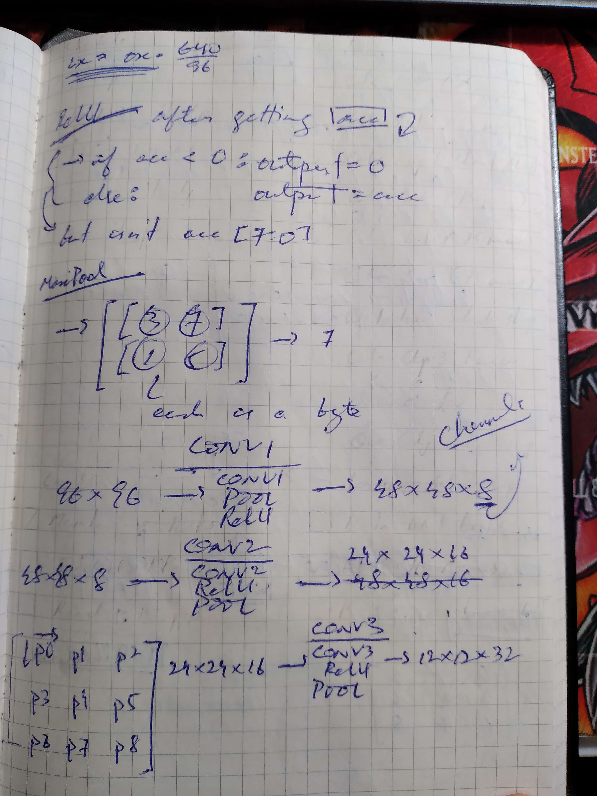
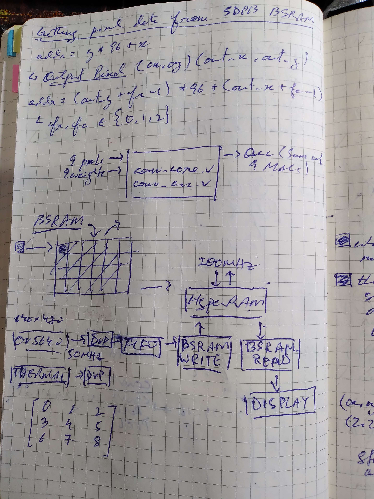
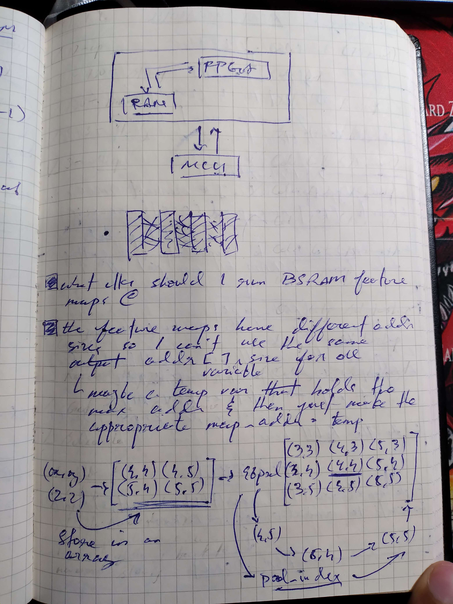
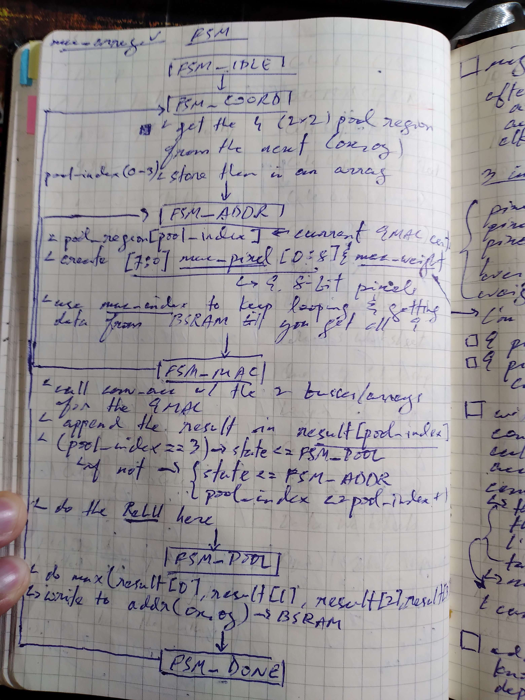
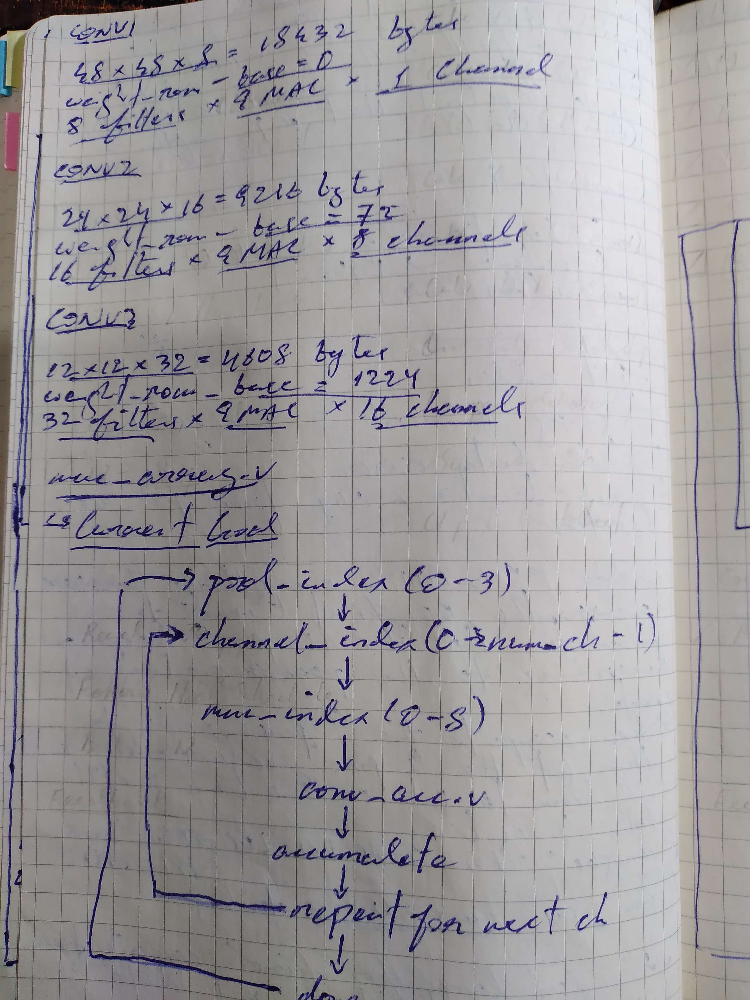
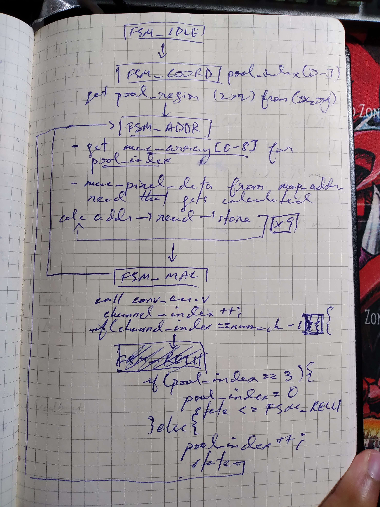

# FPGA CNN Accelerator

A from-scratch CNN inference engine running entirely in Verilog on a **Tang Primer 20K**
(Gowin GW2A-18), with no soft-core CPU. An OV5640 camera feeds a small convolutional
network that classifies a hand gesture as a finger count from **0 to 5**.

This branch (`uart-data-collection`) is focused on camera bring-up and streaming
captured frames to a PC over UART for dataset collection and pipeline validation —
the CNN inference stages exist in the repo but are not yet wired into the active
build here.

## Block diagram

## Module map

| Stage | File | Role |
|---|---|---|
| Camera config | `i2c_bitbang_cam.v` | Bit-banged SCCB (I2C-like) master; writes the OV5640's init register sequence (`OV5640LUT.v`) |
| Camera clock | `Gowin_rPLL` (`gowin_rpll/`) | Generates the sensor's XCLK from the 27MHz board oscillator |
| Capture | `dvp_capture.v` | Decodes the 8-bit DVP bus into full-resolution Y (luma) and subsampled CbCr |
| Preprocess | `preprocessor.v` | Nearest-neighbor decimates 640x480 → 96x96, centers luma around 0 for signed CNN math |
| Conv/pool | `mac_array.v` | Single reusable MAC datapath, time-multiplexed across all 3 conv layers via `conv_layer_sel` |
| Orchestration | `cnn_top.v` | Sequences conv → pool → GAP → FC stages frame-to-frame |
| Global pooling | `global_avg_pool.v` | Averages each of the 32 channels in feature map C down to one value each |
| Classifier | `classifier.v` | Fully-connected layer over the 32 GAP outputs, argmax → finger-count class (0-5) |
| Weights | `weight_rom.v` | Quantized (int8) conv + FC weights in on-chip pROM |
| UART out | `uart.v`, `uart_frame_sender.v` | Streams either the classification result or raw frame data to a PC at 921600 baud |
| Top-level | `top.v` | Wires everything together; the active build on this branch is the camera → UART data-collection path |

## Hardware

- **FPGA**: Sipeed Tang Primer 20K (Gowin GW2A-18, `GW2A-LV18PG256C8/I7`)
- **Camera**: OV5640, DVP parallel interface, YUV422 output
- **Toolchain**: Gowin EDA V1.9.12
- **PC link**: UART @ 921600 baud, USB-serial adapter

## Design notes

Working notes from the design process — memory addressing math, the MAC-array FSM,
pipeline sketches, and sizing calculations for the feature-map BRAMs.

| | |
|---|---|
|  |  |
| Pipeline overview: OV5640 → `dvp_capture` → `preprocessor` → UART/BSRAM → PC | Feature map BSRAM layout (48×48×8, 24×24×16, 12×12×32) and the conv core/accumulator split |
|  |  |
| `preprocessor.v` scaling math — mapping 640×480 input coordinates to the 96×96 output grid | ReLU/MaxPool logic and the CONV1→CONV2→CONV3 channel/dimension flow (96×96×1 → 48×48×8 → 24×24×16 → 12×12×32) |
|  |  |
| BSRAM pixel addressing (`addr = y*96 + x`) and the 640×480 DVP→FIFO→BSRAM→display path | Early FPGA/RAM/MCU block sketch, plus working notes on per-feature-map addressing |
|  |  |
| `mac_array.v` FSM, first pass: `IDLE → COORD → ADDR → MAC → POOL → DONE` | Weight ROM byte counts and base addresses per conv layer (CONV1/2/3) |
|  | |
| `mac_array.v` FSM, refined: adds the per-channel accumulate loop and pool-index increment logic | |

## Status

Camera bring-up (SCCB config, DVP capture, decimation, UART streaming) is verified
working end-to-end, confirmed with both synthetic test patterns and live camera
frames. The CNN inference stages (`mac_array.v`, `classifier.v`, `global_avg_pool.v`,
`weight_rom.v`) are implemented but not yet connected into the active top-level build
on this branch — that integration, plus training/quantizing real weights from
collected gesture data, is the next phase of the project.
