# FPGA CNN Accelerator

A from-scratch CNN inference engine running entirely in Verilog on a **Tang Primer 20K**
(Gowin GW2A-18C), with no soft-core CPU and no vendor neural-net IP. A PC webcam feeds
96x96 grayscale frames over UART; the FPGA classifies the hand gesture in the frame as a
finger count from **0 to 5** and reports the result back over UART (and on the board's LEDs)
in real time.

**Real hardware accuracy: 84.3%** (253/300 held-out test images), close to the 88.1%
validation accuracy of the trained model — trained on a 3,547-image dataset collected by hand.

## Block diagram

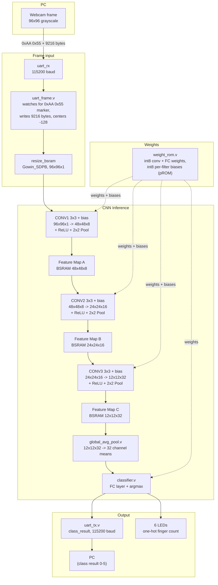

## Module map

| Stage | File | Role |
|---|---|---|
| Frame input | `uart.v` (`uart_rx`) | UART receiver, 115200 baud, no PLL (raw 27MHz board oscillator) |
| Frame assembly | `uart_frame.v` | Watches for the `0xAA 0x55` sync marker, writes the next 9216 payload bytes into the resize BSRAM, centers each pixel (`pixel - 128`) for signed CNN math |
| Resize buffer | `Gowin_SDPB` (`gowin_sdpb/`) | 96x96x1 scratch buffer holding the incoming frame |
| Orchestration | `cnn_top.v` | Sequences conv → GAP → FC stages frame-to-frame |
| Conv/pool/bias/ReLU | `mac_array.v` | Single reusable MAC datapath, time-multiplexed across all 3 conv layers via `conv_layer_sel`; folds bias-add, ReLU, and 2x2 max-pool into its own FSM (no separate pool/relu stage) |
| Accumulator | `conv_acc.v` | 9-tap signed multiply-accumulate for one conv window |
| Feature maps | `Gowin_SDPB_A/B/C` (`gowin_sdpb/`) | On-chip BRAM scratch buffers for each conv layer's output (48x48x8, 24x24x16, 12x12x32) |
| Global pooling | `global_avg_pool.v` | Averages each of the 32 channels in feature map C down to one value each |
| Classifier | `classifier.v` | Fully-connected layer over the 32 GAP outputs, argmax → finger-count class (0-5) |
| Weights | `weight_rom.v` + `gowin_prom/` | Quantized int8 conv/FC weights and per-filter biases in on-chip pROM, generated directly from the trained model |
| Result output | `uart_tx.v` | Sends `class_result` back to the PC as a single byte once per completed classification, for automated test scripts |
| Top-level | `top.v` | Wires everything together; single clock domain, no PLL |

**Retained but unused** (`cam_line_buffer_30rows.v`, `preprocessor.v`, `pool.v`, `relu.v`): leftover from the earlier OV5640-camera design. Not instantiated anywhere in the current `top.v` hierarchy — the synthesizer doesn't compile them into the design — kept in the tree for reference rather than deleted outright.

## Hardware

- **FPGA**: Sipeed Tang Primer 20K (Gowin GW2A-18C, `GW2A-LV18PG256C8/I7`)
- **Image source**: PC webcam (OpenCV) — the OV5640 camera used in earlier revisions of this project was dropped in favor of streaming frames over UART from a PC
- **Toolchain**: Gowin EDA V1.9.11
- **PC link**: UART @ 115200 baud (both directions), USB-serial adapter

## Results

| Metric | Value |
|---|---|
| Dataset | 3,547 self-collected images, 6 classes (0-5 fingers) |
| Train/val split | 3,017 / 530 (85/15) |
| Validation accuracy (trained model) | 88.1% |
| Measured accuracy (real FPGA, 300 test images) | 84.3% |
| Logic utilization (GW2A-18C) | 1,846/20,736 LUT+ALU+ROM16 (9%) |
| Register utilization | 843/16,173 (6%) |
| Block RAM utilization | 27/46 (59%) — the binding resource, from feature-map buffering |

The ~4-point drop from validation accuracy to real hardware accuracy reflects the RTL's
int8 fixed-point implementation of the quantization-aware-trained model, not a hardware bug —
confirmed via cycle-accurate simulation against the same model run in PyTorch.

## Design notes (historical)

Working notes from the original camera-based design phase — memory addressing math, the
MAC-array FSM, and pipeline sketches. The overall CNN datapath (conv/pool FSM structure,
feature-map BRAM addressing) carried forward into the current design; the camera-specific
capture/decimation stages did not.

| | |
|---|---|
|  |  |
| Pipeline overview (early camera-based design) | Feature map BSRAM layout (48×48×8, 24×24×16, 12×12×32) and the conv core/accumulator split |
|  |  |
| `preprocessor.v` scaling math (superseded by `uart_frame.v`'s direct 96x96 write) | ReLU/MaxPool logic and the CONV1→CONV2→CONV3 channel/dimension flow (96×96×1 → 48×48×8 → 24×24×16 → 12×12×32), unchanged in the current design |
|  |  |
| BSRAM pixel addressing (`addr = y*96 + x`), still used | Early FPGA/RAM/MCU block sketch, plus working notes on per-feature-map addressing |
|  |  |
| `mac_array.v` FSM, first pass: `IDLE → COORD → ADDR → MAC → POOL → DONE` | Weight ROM byte counts and base addresses per conv layer (CONV1/2/3) |
|  | |
| `mac_array.v` FSM, refined: adds the per-channel accumulate loop and pool-index increment logic | |

## Pipeline test log (historical — OV5640 camera bring-up)

Bring-up log from when the project used a live OV5640 camera feeding the FPGA directly
over a DVP parallel interface. Superseded by the current PC-webcam-over-UART input path,
kept for reference.

| Pipeline | Expected | Actual |
|---|---|---|
| Synthetic pattern → `Gowin_SDPB` (96×96) → UART | 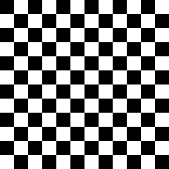 | 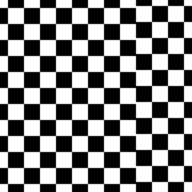 |
| Synthetic pattern → `preprocessor` (pre-fix) → `Gowin_SDPB` → UART |  | 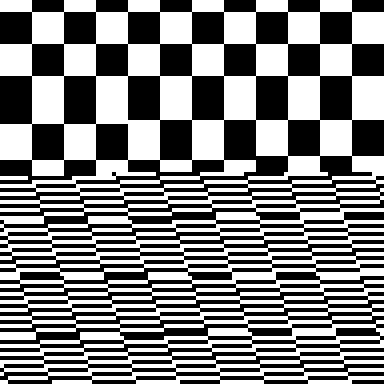 |
| Synthetic pattern → `preprocessor` (fixed) → `Gowin_SDPB` → UART | 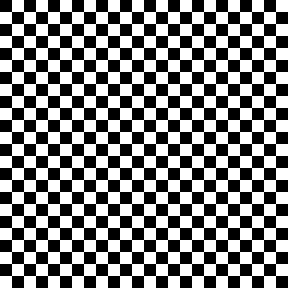 | 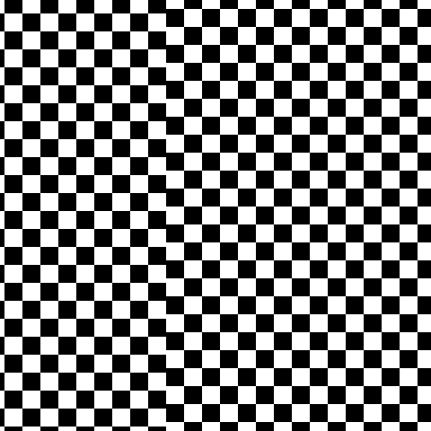 |
| Real camera → `dvp_capture` → `preprocessor` → `Gowin_SDPB` → UART | — | 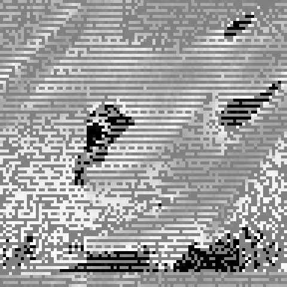 |
| Synthetic pattern (continuous, unfrozen) → `preprocessor` → `Gowin_SDPB` → UART |  | 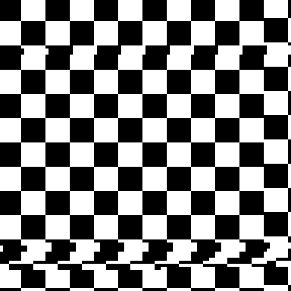 |
| Real camera → `dvp_capture` → `cam_line_buffer_30rows` → UART (close / medium / far) | — | 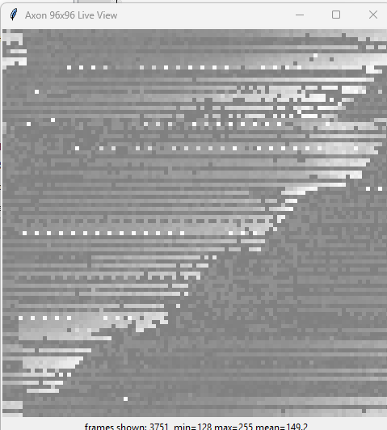 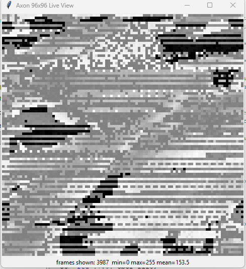 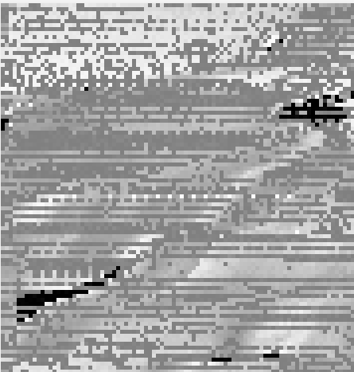 |
| Synthetic pattern (real `cam_pclk`) → `preprocessor` → `cam_line_buffer_30rows` (96×96) → UART |  | 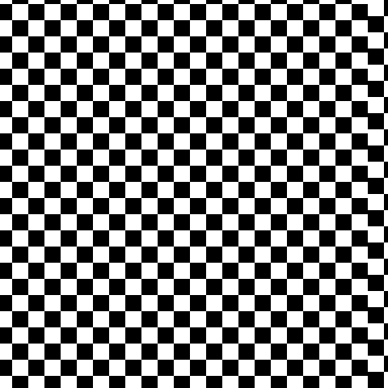 |

## Status

Complete and working end-to-end: a PC webcam feed streams over UART to the FPGA, which
classifies the hand gesture entirely on-chip (no CPU) and reports the result back over UART
and on the board's LEDs in real time, at 84.3% measured accuracy on real hardware.
